# 漫剧创作 Skill 套件

基于 Agnes AI 2.5 Flash 套件，实现从小说章节到完整漫剧视频的端到端创作。

## 安装

给 Agent 安装指令：

```
请安装 Agnesai 漫剧创作 Skill：https://github.com/Lusensec/agnesai-manju-creation-skills
```

## 配置

1. 编辑环境变量文件：
```bash
cp .env.example .env
```

2. 填入 Agnes AI API Key：
```bash
AGNES_API_KEY=sk-你的实际 API Key
```

> 获取 API Key：https://platform.agnes-ai.cn

## 快速开始

### Agent 创作

```bash
初始化项目
```

### Web GUI 创作

在 Agent 中输入：

```
打开漫剧创作 Web GUI
```

## 创作流程图

### 完整创作流程

```mermaid
flowchart TD
    A[👤 用户触发漫剧创作] --> B[🤖 Agent 检测触发词]
    B --> C[📦 加载 manju-creation Skill]
    
    C --> D{选择模式}
    D -->|工作流模式| E[运行 workflow.ps1]
    D -->|手动模式| F[分步执行各脚本]
    
    E --> G[第一步：项目初始化]
    F --> G
    
    G --> G1[🔍 前置检查<br/>API Key / sqlite3]
    G1 --> G2[❓ 交互式配置收集]
    G2 --> G3[📋 创建目录结构]
    G3 --> G4[💾 初始化数据库]
    G4 --> G5[📝 生成项目配置]
    G5 --> H[第二步：剧本创作]
    
    H --> H1[📖 读取小说章节]
    H1 --> H2[🤖 调用 Agnes 2.5 Flash]
    H2 --> H3[✍️ 生成剧本内容]
    H3 --> H4[👤 用户确认/修改]
    H4 --> H5[💾 保存剧本 + 数据库]
    H5 --> I[第三步：资产提取]
    
    I --> I1[📝 读取剧本内容]
    I1 --> I2[🤖 调用对话模型]
    I2 --> I3[📋 提取资产清单<br/>角色/场景/道具]
    I3 --> I4[👤 展示清单]
    I4 --> I5{是否自动创建？}
    I5 -->|是| I6[🎨 批量生成资产图]
    I5 -->|否| I7[⏭️ 跳过自动创建]
    I6 --> I8[📊 更新 asset_manifest.json]
    I7 --> I8
    I8 --> J[第四步：资产生成]
    
    J --> J1[⏳ 速率限制检查<br/>10次/分钟]
    J1 --> J2[🎨 调用图像模型]
    J2 --> J3[📸 生成角色/场景/道具图]
    J3 --> J4[👤 用户确认/修改]
    J4 --> J5[📊 更新索引]
    J5 --> K[第五步：导演分镜]
    
    K --> K1[📝 读取剧本内容]
    K1 --> K2[🤖 调用对话模型]
    K2 --> K3[🎬 生成导演规划]
    K3 --> K4[📊 生成分镜表]
    K4 --> K5[👤 用户确认/修改]
    K5 --> L[第六步：分镜图创作]
    
    L --> L1[⏳ 速率限制检查<br/>10次/分钟]
    L1 --> L2[🖼️ 多图合成生成]
    L2 --> L3[📸 生成分镜图片]
    L3 --> L4[👤 用户确认/修改]
    L4 --> L5[📊 更新索引文件]
    L5 --> M[第七步：视频创作]
    
    M --> M1[⏳ 严格串行生成<br/>1次/分钟]
    M1 --> M2[🎥 调用视频模型]
    M2 --> M3[📹 生成视频片段]
    M3 --> M4[👤 用户确认/修改]
    M4 --> M5[💾 保存视频索引]
    
    M5 --> N[✅ 创作完成]
    
    style A fill:#e1f5fe
    style B fill:#fff3e0
    style C fill:#f3e5f5
    style G fill:#e8f5e9
    style H fill:#e3f2fd
    style I fill:#fff3e0
    style J fill:#fce4ec
    style K fill:#f3e5f5
    style L fill:#e0f2f1
    style M fill:#fff8e1
    style N fill:#c8e6c9
```



### 六步详解

| 步骤 | 功能 | Agent 交互点 | API 模型 | 速率限制 |
|------|------|-------------|----------|----------|
| **1. 初始化** | 收集配置、创建目录结构 | ❓ 询问项目名称、风格、时长 | - | - |
| **2. 剧本** | 生成剧本并保存 | ✅ 展示剧本，询问是否修改 | agnes-2.5-flash | 20次/分钟 |
| **3. 资产提取** | 从剧本提取资产清单 | ✅ 展示清单，询问是否自动创建 | agnes-2.5-flash | 20次/分钟 |
| **4. 资产生成** | 生成角色/场景/道具图 | ✅ 展示资产，询问是否重新生成 | agnes-image-2.5-flash | 10次/分钟 |
| **5. 分镜** | 生成导演规划和分镜表 | ✅ 展示分镜，询问是否修改 | agnes-2.5-flash | 20次/分钟 |
| **6. 分镜图** | 多图合成生成分镜图 | ✅ 展示分镜图，询问是否修改 | agnes-image-2.5-flash (多图) | 10次/分钟 |
| **7. 视频** | 图片参考生成视频 | ✅ 展示视频，询问是否修改 | agnes-video-2.5-flash | 1次/分钟 |

### Agent 与用户交互说明

```
┌─────────────────────────────────────────────────────────┐
│                    交互流程                              │
├─────────────────────────────────────────────────────────┤
│                                                         │
│  🤖 Agent: "请输入项目名称"                              │
│      ↓                                                  │
│  👤 用户: "我的穿越剧"                                  │
│      ↓                                                  │
│  🤖 Agent: "请选择艺术风格（1-4）"                       │
│      ↓                                                  │
│  👤 用户: "1"                                           │
│      ↓                                                  │
│  🤖 Agent: [显示确认清单]                                │
│      ↓                                                  │
│  👤 用户: "确认"                                        │
│      ↓                                                  │
│  🤖 Agent: [执行初始化，创建目录和数据库]                 │
│                                                         │
└─────────────────────────────────────────────────────────┘
```

**说明：**
- ❓ 询问用户 = Agent 通过 `Read-Host` 等待用户输入
- ✅ 确认修改 = Agent 展示生成结果，等待用户确认或提出修改意见
- 所有交互均在 DSH Web GUI 或 PowerShell 终端中完成

### 关键文件说明

| 文件 | 作用 |
|------|------|
| `scripts/init_project.ps1` | 交互式初始化，收集配置 |
| `scripts/workflow.ps1` | 六步创作全流程 |
| `libs/rate-limiter.ps1` | 速率限制器（自动等待） |
| `libs/api-client.ps1` | API 调用封装（含重试） |
| `libs/manifest-manager.ps1` | 资产索引管理 |

---

### 速率限制与重试机制

| API 模型 | 限制 | 自动行为 |
|----------|------|----------|
| agnes-2.5-flash | 20次/分钟 | 超限自动等待，最多重试3次 |
| agnes-image-2.5-flash | 10次/分钟 (2K) | 超限自动等待，超时30秒重试 |
| agnes-video-2.5-flash | 1次/分钟 | 严格串行，每视频间隔60秒 |

### 重试机制

| 场景 | 行为 |
|------|------|
| API 超时 | 等待 30 秒后重试，最多 3 次 |
| 速率限制 (429) | 等待 60 秒后重试，最多 3 次 |
| 网络错误 | 等待 15 秒后重试，最多 3 次 |
| 视频生成 | 严格串行，每视频间隔 60 秒 |

## 完整流程

```
小说章节 → 项目初始化 → 故事骨架 → 改编策略 → 剧本编写 → 导演规划 → 分镜表 → 分镜面板 → 资产生成 → 视频输出
```

| 阶段 | Skill 文件 | 核心产出 |
|------|-----------|----------|
| 初始化 | `scripts/init_project.ps1` | 项目结构、SQLite数据库 |
| 资产 | `scripts/asset_manager.ps1` | 资产索引、状态跟踪 |
| 剧本 | `script_skills/script_execution_skeleton.md` | 故事骨架、人物小传、分集决策 |
| 剧本 | `script_skills/script_execution_adaptation.md` | 改编原则、删减决策 |
| 剧本 | `script_skills/script_execution_script.md` | 完整剧本（场景、台词、情绪） |
| 制作 | `production_skills/production_execution_director_plan.md` | 分场汇总、情绪分析、过渡设计 |
| 制作 | `production_skills/production_execution_storyboard_table.md` | 分镜表（镜头、景别、运镜） |
| 制作 | `production_skills/production_execution_storyboard_panel.md` | 分镜面板（素材绑定、提示词） |
| 制作 | `production_skills/production_execution_derive_assets.md` | 衍生资产分析 |
| 制作 | `production_skills/production_execution_generate_assets.md` | 衍生资产图片生成 |
| 制作 | `production_skills/production_execution_storyboard_gen.md` | 分镜图生成 |
| 审核 | `agent_skills/production_agent_supervision.md` | 质量审核报告 |

## 目录结构

```
manju-creation/
│
├── SKILL.md                          # 主入口文档，定义 Skill 元数据和触发词
├── README.md                         # 本文件，快速上手和技术文档
├── .env.example                      # API Key 配置模板
│
├── scripts/                          # 工具脚本目录
│   ├── init_project.ps1             # 项目初始化脚本，创建目录结构和数据库
│   ├── asset_manager.ps1            # 资产管理器，管理资产数据
│   └── project_status.ps1           # 项目状态报告，显示进度统计
│
├── db/                               # 数据库目录
│   └── schema.sql                   # SQLite 数据库 Schema 定义
│
├── script_skills/                    # 剧本阶段 Skill 文件
│   ├── script_execution_skeleton.md # 故事骨架搭建
│   ├── script_execution_adaptation.md # 改编策略制定
│   └── script_execution_script.md   # 剧本编写
│
├── production_skills/                # 制作阶段 Skill 文件
│   ├── production_execution_director_plan.md       # 导演规划
│   ├── production_execution_storyboard_table.md    # 分镜表构建
│   ├── production_execution_storyboard_panel.md    # 分镜面板写入
│   ├── production_execution_storyboard_gen.md      # 分镜图生成
│   ├── production_execution_derive_assets.md       # 衍生资产分析
│   ├── production_execution_generate_assets.md     # 衍生资产生成
│   ├── storyboard_prompt_techniques.md             # 分镜提示词技巧
│   └── storyboard_table_techniques.md              # 分镜表技巧
│
├── agent_skills/                     # Agent 决策/监督层 Skill 文件
│   ├── script_agent_decision.md           # 剧本阶段决策层
│   ├── production_agent_decision.md       # 制作阶段决策层
│   └── production_agent_supervision.md    # 质量审核监督层
│
├── art_styles/                       # 艺术风格参考
│   ├── 2D_chinese_guofeng/            # 2D 国风风格
│   │   ├── README.md                  # 风格说明
│   │   ├── prefix.md                  # 提示词前缀
│   │   ├── art_prompt/                # 艺术提示词模板
│   │   │   ├── art_character.md       # 角色提示词
│   │   │   ├── art_character_derivative.md # 角色衍生提示词
│   │   │   ├── art_scene.md           # 场景提示词
│   │   │   ├── art_scene_derivative.md  # 场景衍生提示词
│   │   │   ├── art_prop.md            # 道具提示词
│   │   │   ├── art_prop_derivative.md # 道具衍生提示词
│   │   │   └── art_storyboard_video.md # 分镜视频提示词
│   │   └── driector_skills/           # 导演技巧
│   │       ├── director_planning_style.md    # 导演规划风格
│   │       ├── director_storyboard.md        # 分镜技巧
│   │       └── director_storyboard_table_style.md # 分镜表风格
│   ├── 2D_flat_design/              # 2D 扁平设计风格
│   ├── 3D_anime_render/             # 3D 动漫渲染风格
│   └── realpeople_modern_city/      # 真人现代都市风格
│
└── ai_models/                        # AI 模型能力参考
    ├── SKILL.md                       # 模型套件总览
    ├── README.md                      # 使用指南
    ├── agnes-2.5-flash/              # 对话模型
    │   ├── SKILL.md                   # 对话模型 Skill
    │   ├── README.md                  # 使用指南
    │   └── examples/                  # 示例脚本
    ├── agnes-image-2.5-flash/        # 图像模型
    │   ├── SKILL.md                   # 图像模型 Skill
    │   ├── README.md                  # 使用指南
    │   └── examples/                  # 示例脚本
    └── agnes-video-2.5-flash/        # 视频模型
        ├── SKILL.md                   # 视频模型 Skill
        ├── README.md                  # 使用指南
        └── examples/                  # 示例脚本
```

## 项目目录结构

```
projects/
└── [项目名]/
    ├── 小说章节/           # 原著小说章节
    │   ├── 第0001章_XXX.md
    │   └── ...
    ├── 图片资产/
    │   ├── 人物/          # 角色资产图片
    │   ├── 场景/          # 场景资产图片
    │   └── 物品/          # 道具资产图片
    ├── 视频资产/
    │   ├── 第01集/        # 第1集视频片段
    │   ├── 第02集/
    │   └── 第03集/
    ├── 剧本/              # 剧本文件 (XML格式)
    ├── 分镜/              # 分镜表文件
    ├── 导演规划/          # 导演规划文档
    ├── 资产清单/          # 资产索引文件
    ├── 数据库/            # SQLite 数据库
    │   └── 项目名.db
    ├── project_config.json # 项目配置
    └── README.md          # 项目说明
```

## 数据库架构

采用 SQLite 混合方案管理项目数据：

| 表名 | 说明 |
|------|------|
| `projects` | 项目配置信息 |
| `assets` | 资产主表（角色/场景/道具） |
| `characters` | 角色扩展信息 |
| `scenes` | 场景扩展信息 |
| `scripts` | 剧本内容 |
| `storyboards` | 分镜数据 |
| `video_clips` | 视频片段 |
| `project_tasks` | 任务执行记录 |

### 常用查询

```sql
-- 查看资产统计
SELECT type, COUNT(*), SUM(CASE WHEN status='done' THEN 1 ELSE 0 END) as completed
FROM assets GROUP BY type;

-- 查看分镜进度
SELECT episode_number, COUNT(*), SUM(CASE WHEN status='done' THEN 1 ELSE 0 END)
FROM storyboards GROUP BY episode_number;
```

## 艺术风格

支持 10+ 种视觉风格：

### 2D 风格
- `2D_chinese_guofeng` - 中国风（古装、仙侠）
- `2D_flat_design` - 扁平设计（现代、都市）
- `2D_90s_japanese_anime` - 90年代日系动漫（怀旧、青春）
- `2D_mature_urban_romance` - 成熟都市浪漫

### 3D 风格
- `3D_anime_render` - 3D动漫渲染
- `3D_chinese_traditional` - 3D国风
- `3D_clay_stopmotion` - 黏土定格动画
- `3D_guofeng_cyber` - 赛博国风

### 真人风格
- `realpeople_ancient_chinese` - 真人古风
- `realpeople_modern_city` - 真人现代都市
- `realpeople_urban_modern` - 都市职场

## 技术规格

### 对话模型 (agnes-2.5-flash)
- 上下文窗口：512K
- 最大输出：65.5K
- 支持：图像理解、工具调用、Thinking 模式

### 图像模型 (agnes-image-2.5-flash)
- 尺寸：1K / 2K / 3K / 4K
- 宽高比：8 种可选
- 支持：文生图、图生图、多图合成

### 视频模型 (agnes-video-2.5-flash)
- 分辨率：固定 720P
- 时长：4-12 秒
- 支持：文生视频、首尾帧、图片参考(≤5)、音频参考(≤3)

## 相关文档

- [Agnes AI 官方文档](https://agnes-ai.cn/zh-Hans/docs)
- [Agnes AI 平台](https://platform.agnes-ai.cn)
